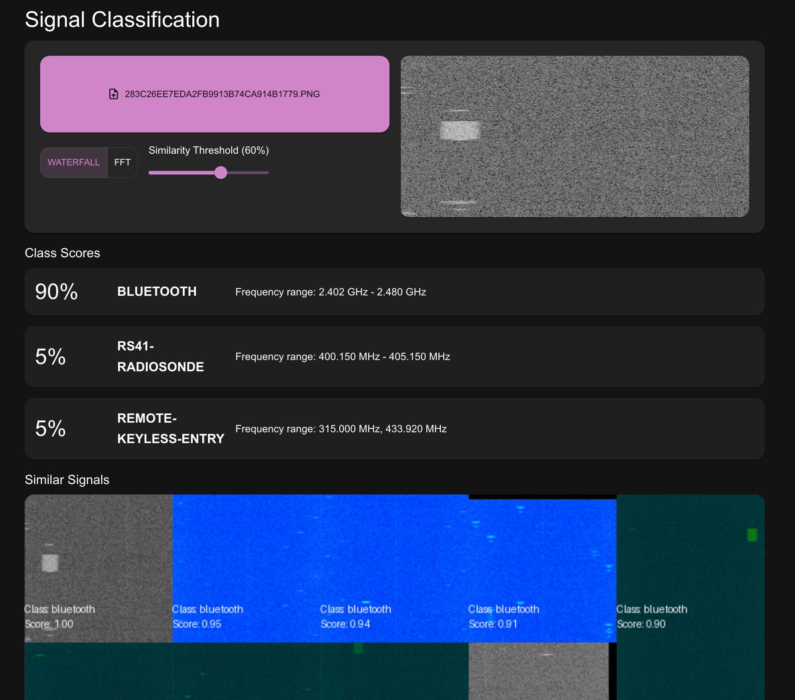
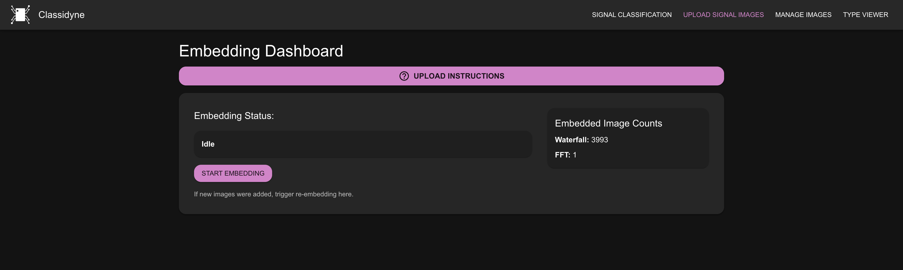
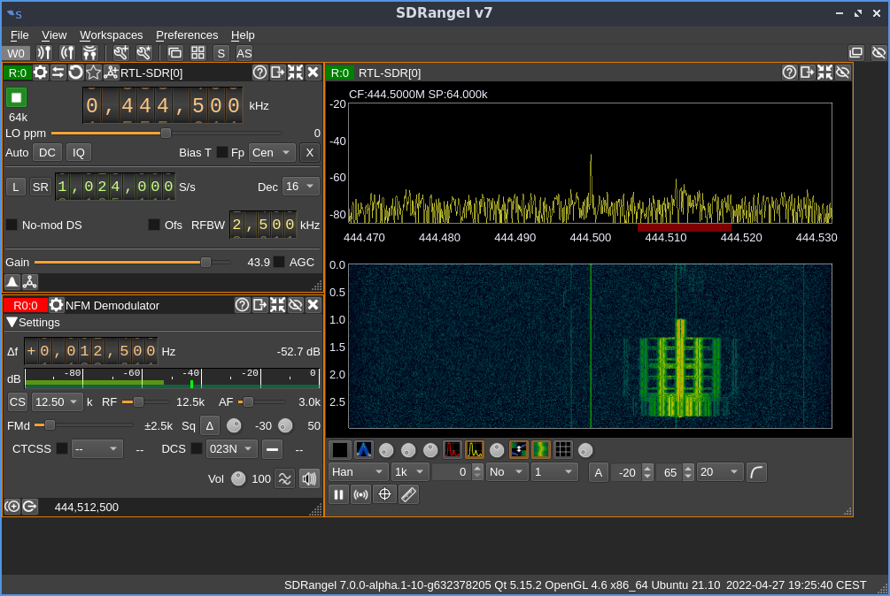
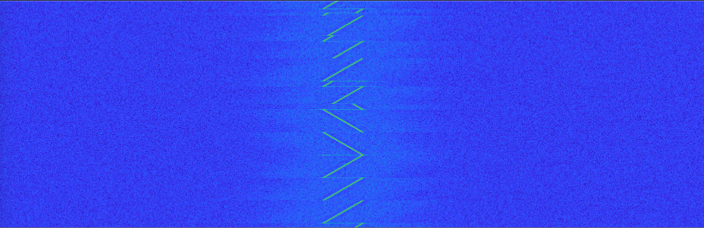
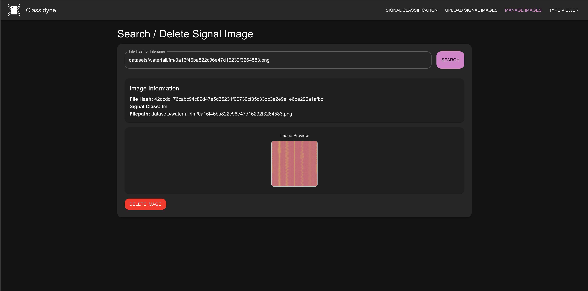
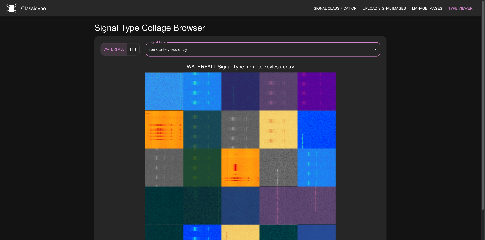

# Classidyne

Classidyne is an AI-powered RF signal classifier that uses computer vision techniques to classify various types of RF signals, such as WiFi, Bluetooth, Cellular, LoRa, and more. This project leverages deep learning models to extract features from images and uses a vector database (Milvus) to find and classify similar signals.

## Getting Started

Follow these steps to set up and run Classidyne on your local machine.

### Prerequisites

- A Linux or Mac Computer
- Python 3.10 or higher
- pip (Python package installer)

### Installation

**IMPORTANT: Using Git LFS (Large File Storage)**

Classidyne uses [Git LFS](https://git-lfs.com/) to manage the RadioNet model.  
**You must install Git LFS before cloning or pulling the repository to ensure all large files are downloaded correctly.**

- **macOS (Homebrew):**

  ```sh
  brew install git-lfs
  git lfs install
  ```

- **Linux (APT):**

  ```sh
  sudo apt update
  sudo apt install git-lfs
  git lfs install
  ```

1. **Clone the repository:**

   ```sh
   git clone https://github.com/skinnyrad/Classidyne.git
   ```

2. **Navigate to the project directory:**

   ```sh
   cd Classidyne
   ```

3. **Pull the model:**

   ```sh
   git lfs pull
   ```

4. **Create a virtual environment:**

   ```sh
   python3 -m venv venv-classidyne
   ```

5. **Activate the virtual environment:**

   ```sh
   source venv-classidyne/bin/activate
   ```

   Hint: You will need to rerun this command every time you relaunch the app.

6. **Install the required dependencies:**

   ```sh
   pip install -r requirements.txt
   ```

7. **Download the Dataset**

To use this project, you will need the Radio Frequency (RF) Signal Image Classification dataset, which is available on [Kaggle: RF Signal Image Classification Dataset](https://www.kaggle.com/datasets/halcy0nic/radio-frequecy-rf-signal-image-classification). Download the dataset from Kaggle and unzip it into your project directory. The dataset already has the correct folder structure, so no additional organization is required. Once unzipped, you will be able to embed the images using the provided tools in this repository.

This dataset contains images of radio frequency (RF) signals captured as waterfall plots using a spectrum analyzer. The dataset is organized as follows:

```
datasets/
   └── waterfall (or FFT)
         └── signal_class/
               └── image
```

For example:

```
datasets/
  └── waterfall (or FFT)
     └── bluetooth/
        └── c17afe0fe5cc3cc1308605cf390ecbb5.png
```

8. **Run the project:**

```sh
python app.py
```

## Usage

#### Common Workflow

1. Add signals and create the database using the 'Upload Signal Images' tab. **The first time you run the tool, you must create the database before anything else.** Please reference the 'Add New Signals' section.

2. Classify a signal by uploading an image from the 'Signal Classifier' tab.

3. To add new signals over time, reference the 'Add New Signals' section.

### Signal Classification

1. **Upload an Image:**
   - Navigate to the "Signal Classification" tab.
   - Choose which type(s) of images you want to search by. (Hint: Waterfall will typically be more accurate, so 'Waterfall' is recommended.)
   - Upload the image(s) of an RF signal from the waterfall or FFT plot of a spectrum analyzer (supported formats: jpg, jpeg, png, gif, tiff, tif, bmp, webp).
   - The application will display the uploaded image and show similar images from the database, along with confidence scores indicating the type of signal the application believes it to be. The known frequencies for that signal type will be shown.



### Add New Signals

1. **Organize Your Images:**

   - Place each image in the correct folder based on its signal type.
   - Example: `datasets/waterfall/wifi/` for waterfall WiFi signals, `datasets/fft/bluetooth/` for fft Bluetooth signals.

2. **Folder Structure:**

   - Ensure all images are in folders following this pattern: `datasets/img-type/signal-type/` where `img-type` is either waterfall or fft and `signal-type` is the specific type of signal (e.g., wifi, bluetooth).

3. **Unknown Signals:**

   - If you're unsure of the signal type, place the image in `datasets/img-type/unknown/`.

4. **Upload Images:**

   - Navigate to the "Upload Signal Images" tab.
   - Click the "START EMBEDDING" button to add the images to the signal database.

5. **To reset the database, delete the 'classidyne.db' file before starting the embedding process.**



##### Image Capture Guidelines

The more signal images you add to the Classidyne database, the better the application will be at detecting and classifying signals. In this lab, we are going to capture quality signal images using SDRAngel and a software-defined radio to enhance the proficiency of our AI classification system. Here are a few general rules to follow when capturing signals:

1. The images should be in png, jpg, or jpeg format for best results.
2. Capture the waterfall plot of the signal and/or the spectrum analyzer plot. (Again, the waterfall will typically classify more accurately, so it is always recommended.)
3. Focus solely on capturing the plot itself, ensuring that the image contains only the signal visualization. Exclude any extraneous elements such as SDR software interfaces, desktop backgrounds, or other visual distractions. To illustrate, the following would be considered a bad capture:



The next image would be considered a good capture:



4. Capture the signal in various colors using a variety of sampling rates when possible.
5. Isolate the signal and do not include mixed signals in the database. For example, an image with both Bluetooth and WiFi in the image should not be added to the database. It is better to isolate the signal when possible into either Bluetooth, WiFi, etc.
6. Capture multiple images for the same signal to increase the robustness of the AI model.
7. Attempt to capture the signals at multiple different gain/power levels.
8. Remember that your images have to be labeled with the correct signal type (please reference the ‘Adding New Signals’ portion of Classidyne for more information).

### Image Management

**Search or Delete Images:**

- Navigate to the "Image Search" tab.
- Enter the corresponding hash or filename and click "Search".
- If desired, click the delete button to remove the image from the database. This will not remove the file itself, so reembedding while the file is still in the proper folder will reinsert the image into the database.



### Signal Type Searching

**Type Viewing**

- Navigate to the Signal Type Search tab and select Type Viewer.
- From the dropdown menu, type in or select the signal type to be viewed.
- If images are found, the type viewer will display waterfalls and ffts for that specific signal type.



## License

Shield: [![CC BY-NC-SA 4.0][cc-by-nc-sa-shield]][cc-by-nc-sa]

Classidyne © 2025 by Skinny Research & Development is licensed under
[Creative Commons Attribution-NonCommercial-ShareAlike 4.0 International License][cc-by-nc-sa].

[![CC BY-NC-SA 4.0][cc-by-nc-sa-image]][cc-by-nc-sa]

[cc-by-nc-sa]: http://creativecommons.org/licenses/by-nc-sa/4.0/
[cc-by-nc-sa-image]: https://licensebuttons.net/l/by-nc-sa/4.0/88x31.png
[cc-by-nc-sa-shield]: https://img.shields.io/badge/License-CC%20BY--NC--SA%204.0-lightgrey.svg
